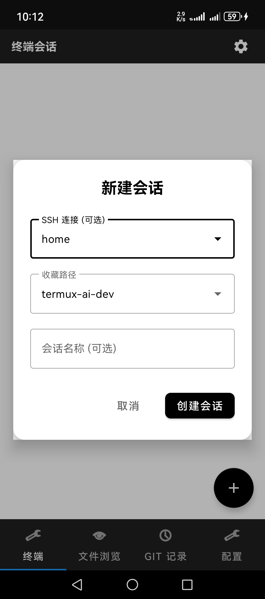
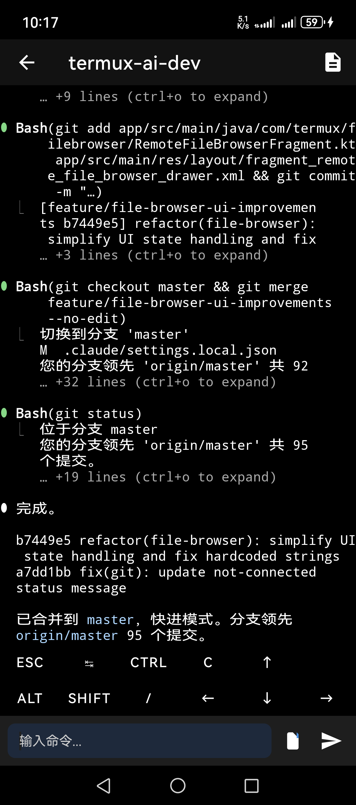
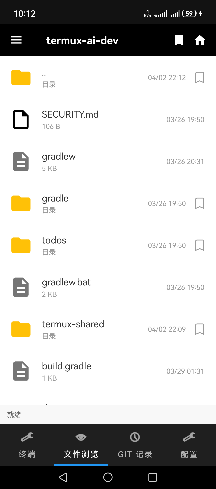
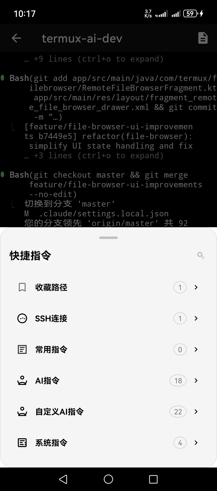
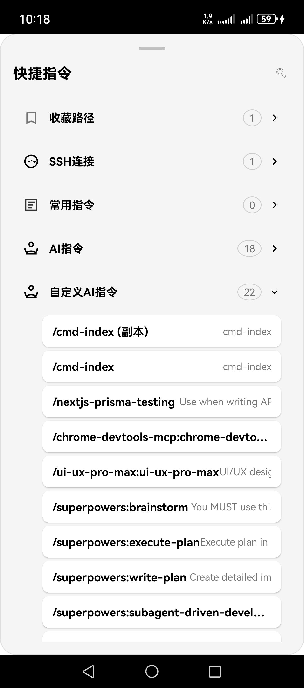
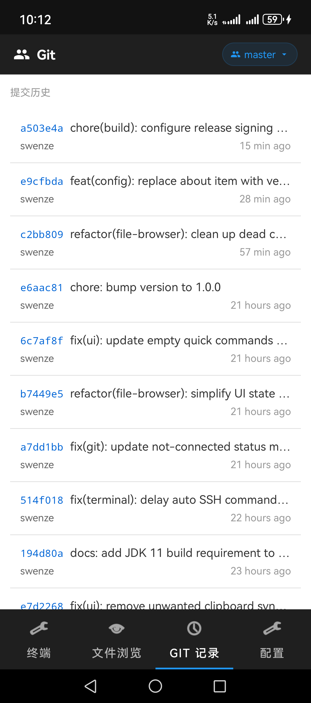

<p align="center">
  
</p>

<h1 align="center">PocketCode</h1>

<p align="center">
  <strong>Claude Code Remote Dev Terminal for Android | SSH SFTP File Manager | Mobile AI Coding IDE</strong>
</p>

<p align="center">
  <a href="#features-overview">Features</a> •
  <a href="#download--installation">Install</a> •
  <a href="#quick-start">Quick Start</a> •
  <a href="#user-guide">User Guide</a> •
  <a href="#remote-connection-tips">Remote Tips</a> •
  <a href="#acknowledgements">Credits</a>
   
  <a href="README_CN.md">中文文档</a>
</p>

---

## Introduction

**PocketCode** is a deeply customized [Termux](https://github.com/termux/termux-app) (v0.118.0) Android terminal app built for mobile remote development. Retaining the full terminal power of Termux, it adds a VSCode-style remote file browser, Git history viewer, Claude Code quick-command integration, clipboard sync, project management, and other workstation-grade features.

> Use Claude Code on your Android phone to write code, manage remote server files, and browse Git history — your pocket dev workstation. Supports SSH remote connections, SFTP file browsing, terminal emulation, clipboard sync — the ideal tool for mobile AI-assisted programming.

> **This project is built on top of [Termux](https://github.com/termux/termux-app), licensed under GPLv3.**
> Termux is a powerful Android terminal emulator and Linux environment app maintained by the Termux community. Huge thanks to the Termux team.

### Highlights

- **4-Tab Workbench** — Terminal sessions / Remote file browser / Git history / Settings hub
- **Claude Code Integration** — 18 built-in quick commands + custom command menu + clipboard sync
- **VSCode-Style File Browser** — Directory tree navigation + bookmarks + syntax-highlighted preview
- **Git Visualization** — Commit history + branch switching + colored diff viewer
- **One-Click Project Run** — Pre-configured run commands for Node.js / Python / Java / Go / PHP / Ruby

---

## Features Overview

<p align="center">
  
  
  
</p>
<p align="center">
  
  
  
</p>

| Session | Terminal | File Browser |
|:---:|:---:|:---:|
| Multi-session SSH management with password & key auth | Multi-session terminal with built-in Claude Code menu | SFTP remote file list with browsing & download |

| Quick Commands | Custom Commands | Git History |
|:---:|:---:|:---:|
| 18 AI built-in commands at your fingertips | Sync Claude Code custom skills from remote server | View Git commit history and file changes |

```
┌──────────────────────────────────────────────────┐
│  Tab 0: Terminal     │  Tab 1: Remote Files      │
│  · Multi-session     │  · SFTP file browsing      │
│  · Quick SSH connect │  · Directory tree + Bookmarks│
│  · Claude Code menu  │  · Syntax highlight preview │
│  · Quick commands    │  · File download / Info     │
├──────────────────────────────────────────────────┤
│  Tab 2: Git History  │  Tab 3: Settings           │
│  · Commit list       │  · SSH connection config    │
│  · Branch switching  │  · Run config management    │
│  · File Diff viewer  │  · Quick command management │
│  · Directory sync    │  · Global settings          │
└──────────────────────────────────────────────────┘
```

---

## Download & Installation

### Requirements

- Android 5.0 (API 21) or above
- Supported architectures: `arm64-v8a`, `armeabi-v7a`, `x86_64`

### Build Environment

- **JDK 11** (required) — The project uses AGP 4.2.2 + Gradle 7.2, incompatible with JDK 8 or JDK 17+
- **Android SDK** — API 28+ recommended (compileSdkVersion)
- **Gradle 7.2** — Gradle Wrapper is included, no separate install needed

```bash
# Verify Java version (must be 11.x)
java -version
# Output should be: openjdk version "11.x.x" or javac 11.x.x

# If wrong version, set JAVA_HOME:
export JAVA_HOME=/path/to/jdk-11
```

> **Tip**: Download JDK 11 from [Adoptium](https://adoptium.net/). Android Studio's bundled JDK also works (Help → About to check version).

### Build

```bash
# Clone the project
git clone https://github.com/YOUR_USERNAME/termux-ai-dev.git
cd termux-ai-dev

# Build Debug APK
./gradlew app:assembleDebug

# Build Release APK
./gradlew app:assembleRelease

# APK output path (format: pocketcode_v{version}_{buildType}_{arch}.apk)
# app/build/outputs/apk/debug/pocketcode_v1.0.0_debug_arm64-v8a.apk
# app/build/outputs/apk/release/pocketcode_v1.0.0_release_arm64-v8a.apk
```

---

## Quick Start

### 1. First Launch

After installing the APK, the app automatically initializes on first open (~40 seconds):

- **Bootstrap install** — Extracts architecture-specific Linux filesystem
- **Environment setup** — Creates `$PREFIX` directories, sets PATH, creates symlinks
- **Storage mount** — Creates symlinks to shared storage, downloads, pictures, etc. under `~/storage/`

> **SSH ready out of the box** — openssh and sshpass are pre-installed in the Bootstrap.

> If initialization fails, try clearing app data and relaunching.

### 2. Configure SSH Connection

1. Go to the **Settings** tab
2. Tap **SSH Config**
3. Tap `+` to create a new connection and fill in:
   - **Name**: e.g. `My Server`
   - **IP Address**: server IP or domain
   - **Port**: default 22
   - **Username**: login username
   - **Password**: login password (key auth optional)
4. Tap **Test Connection** to verify, then **Save**

---

## User Guide

### Tab 0: Terminal Sessions

#### Multi-Session Management

- **New session** — Tap the `+` button at bottom right to:
  - Associate an SSH connection (auto-login to remote server)
  - Set a startup path (via saved paths)
  - Customize session name
- **Switch sessions** — Tap a session in the list
- **Session actions** — Long-press a session card for options (rename / close)
- **Session status** — Each session shows a real-time status label (running / idle / error, etc.)

#### Claude Code Quick Command Menu

In the terminal, tap the **menu button to the left of the input box** (or press `Ctrl+/` / `Shift+Tab`) to open the BottomSheet menu:

| Category | Content |
|----------|---------|
| **Saved Paths** | Saved common directories; tap to auto `cd` |
| **SSH Connections** | Saved SSH configs; tap to auto-connect |
| **Quick Commands** | User-defined common commands |
| **AI Built-in** | 18 Claude Code built-in commands |
| **AI Custom** | Custom skills synced from remote `~/.claude/commands/` |
| **System** | `claude`, `claude --resume`, `claude -p`, `codex` |

**Built-in Claude Code Commands:**

| Command | Description |
|---------|-------------|
| `/resume` | Resume last session |
| `/clear` | Clear conversation |
| `/compact` | Compact context |
| `/model` | Switch model |
| `/config` | Open config |
| `/help` | Help info |
| `/init` | Initialize project |
| `/cost` | Token usage |
| `/status` | View status |
| `/permissions` | Permission management |
| `/memory` | Edit memory file |
| `/doctor` | Health check |
| `/mcp` | MCP server management |
| `/add-dir` | Add working directory |
| `/review` | Code review |
| `/bug` | Report bug |
| `/terminal-setup` | Terminal setup |
| `/vim` | Vim input mode |

#### Keyboard Shortcuts

| Shortcut | Action |
|----------|--------|
| `Ctrl + /` | Open Claude Code menu |
| `Shift + Tab` | Open Claude Code menu |
| `Ctrl + L` | Clear screen |
| `Ctrl + C` | Interrupt signal |
| `Ctrl + Enter` | Send command |

#### Extra Keys Bar

A control-key shortcut bar at the bottom of the terminal: `ESC`, `TAB`, `CTRL`, arrow keys, `ALT`, `SHIFT`, etc. for devices without a hardware keyboard.

---

### Tab 1: Remote File Browser

#### File Browsing

- **Left drawer** — VSCode-style directory tree navigation (50% screen width)
- **Connection indicator** — Green/gray dot showing current SSH connection status
- **File list** — Shows filename, size, modified time, permissions
- **Pull to refresh** — SwipeRefreshLayout support
- **Home button** — One tap to return to remote user home directory

#### File Operations

Long-press a file or tap its action button to open the operations panel:

| Action | Description |
|--------|-------------|
| **View Content** | Built-in code viewer with syntax highlighting (Java/Kotlin/XML/HTML/CSS/JS/JSON/Markdown/Python/Shell/C/C++, etc.) |
| **Download** | Download file to Android device via SFTP |
| **Add Bookmark** | Add file/directory path to favorites |
| **Copy Path** | Copy remote path to clipboard |
| **File Info** | View detailed properties (type/path/size/modified/permissions/MIME, etc.) |

**Image Preview** — Tap JPG/PNG/GIF/WebP files for a direct image preview popup.

#### Bookmark Management

- **Add bookmark** — Tap "Add to Bookmarks" in the file action panel
- **Manage bookmarks** — Open bookmark manager from the left drawer menu:
  - Rename bookmark
  - Remove bookmark
  - Send bookmark path to terminal (auto `cd`)
- **Quick save** — Long-press directory path bar to save current directory
- **Workspace persistence** — Each SSH connection maintains independent workspace state (expanded directories, scroll position, etc.)

#### Directory Sync

The file browser syncs with the **Git History** tab — switching directories automatically updates the Git history for the current path.

---

### Tab 2: Git History

#### Commit History

- **Pagination** — Auto-loads more commits on scroll to bottom
- **Branch display** — Current branch name shown at top
- **Branch switching** — Tap branch name to open branch picker dialog
- **Expand details** — Tap a commit to expand and view changed files

#### Changed Files

Each expanded commit shows a changed files list with status indicators:

| Indicator | Meaning |
|-----------|---------|
| `A` | Added |
| `M` | Modified |
| `D` | Deleted |
| `R` | Renamed |

#### Diff Viewer

Tap a changed file to open **GitFileDetailActivity** with a GitLab-style colored diff view:

- `+` added lines: green background
- `-` removed lines: red background
- Context lines: normal display
- Hunk headers: shows `@@ ... @@` line ranges

---

### Tab 3: Settings Hub

The unified settings entry with five modules:

#### SSH Config

Manage all remote SSH connections. Each config includes:
- Name, IP address, port, username, password
- Key auth support (ED25519 / ECDSA)
- One-tap connection test

#### Run Config

Pre-configured project run commands with auto-detection for **6 languages**:

| Language | Example Commands |
|----------|------------------|
| **Node.js** | `npm run dev`, `yarn dev`, `pnpm dev`, `npm start` |
| **Python** | `python app.py`, `flask run`, `gunicorn app:app` |
| **Java** | `mvn spring-boot:run`, `gradle bootRun`, `java -jar app.jar` |
| **Go** | `go run main.go`, `go build && ./app` |
| **PHP** | `php artisan serve`, `composer serve` |
| **Ruby** | `rails server`, `bundle exec rails s` |

Each run config can set:
- Associated SSH connection
- Project path
- Working directory
- Environment variables
- Port number
- Background run toggle
- Log filename

**Flow**: Select run config → Confirm execution (command preview) → Remote execute → Real-time output

#### Quick Commands

Manage custom command shortcuts. Each command includes:
- Name, command content, description
- Category tag
- Usage count stats

#### Global Settings

- **Floating window toggle** — Show a quick-action overlay button above other apps
- **Remote command test** — Quick execute test commands to verify connection

---

### Floating Window System

Enable the floating window to quickly access features from any app:

- **Quick SSH** — Select a saved SSH config from the floating menu to connect
- **Run commands** — Select a run config for one-tap remote execution
- **Quick settings** — Toggle common settings

> Requires "Display over other apps" permission in system settings.

---

### Clipboard Sync

PocketCode supports **bidirectional clipboard sync** between your Android device and remote server. Content copied on your phone is automatically pushed to the remote server, and content copied on the remote server is automatically pulled to your phone.

#### Prerequisites

Clipboard sync depends on remote server clipboard tools:

| Environment | Required Tool | Install |
|-------------|--------------|---------|
| **Linux Desktop** (Ubuntu/Debian/CentOS, etc.) | `xclip` | `sudo apt install xclip` |
| **macOS** | `pbcopy` / `pbpaste` | Built-in, no install needed |
| **Headless Linux** (no desktop) | Not supported | — |

> **Important**: `xclip` requires an X11 desktop environment. Pure terminal / SSH-only servers cannot use clipboard sync. The app auto-detects the remote server's DISPLAY env var (`:0`, `:1`, etc.) — no manual config needed.

#### Setup Steps

1. **Connect SSH** — Establish an SSH connection in Tab 0 terminal or Tab 1 file browser
2. **Open Global Settings** — Tab 3 Settings → **Global Settings**
3. **Enable master toggle** — Turn on the "Clipboard Sync" main switch
4. **Choose direction** — Enable sub-toggles as needed:
   - **Server → Phone**: Polls remote clipboard every 5 seconds, auto-syncs new content to phone
   - **Phone → Server**: Monitors phone clipboard changes, auto-pushes copied content to remote

#### How It Works

```
┌─────────────┐     SSH exec      ┌─────────────────┐
│  Android App │ ◄──────────────► │  Remote Server   │
│              │                   │                  │
│ ClipboardMgr │  xclip -o (read)  │  X11 Clipboard   │
│   Listener   │  xclip -i (write) │                  │
└─────────────┘                   └─────────────────┘

Server→Phone: Every 5s, runs DISPLAY=:N xclip -o to read remote clipboard
Phone→Server: On phone clipboard change, runs DISPLAY=:N xclip -i to write remote
Loop prevention: MD5 fingerprint comparison to skip already-synced content
```

#### Technical Details

- **Auto-detect backend** — macOS → `pbcopy`/`pbpaste`, Linux → `xclip` (auto-traverse DISPLAY `:1`/`:0`/`:2`)
- **Polling interval** — Checks server clipboard every 5 seconds
- **MD5 dedup** — Fingerprint comparison prevents sync loops
- **Size limit** — 1MB per sync operation
- **Base64 transport** — Commands are base64-encoded via SSH exec to avoid shell escaping issues
- **Auto start/stop** — Starts on SSH connect, stops on disconnect

#### Use Cases

- `git clone` a repo URL on the remote server → phone clipboard auto-gets the URL → paste in phone browser
- Copy code on phone → paste directly in Vim/VSCode on the remote server via `Ctrl+V`
- Share links, commands, config snippets across devices

---

### Built-in Scripts

Access via the **script button** (top-right of terminal session tab):

#### 1. Claude Code Skills Setup (`setup-claude-commands.sh`)

Installs the Claude Code custom skill index system on the remote server:

```bash
# Install on remote server
./setup-claude-commands.sh --install

# Update index
./setup-claude-commands.sh --update
```

**What it does**: Scans all custom commands and skills under `~/.claude/commands/` on the remote server, generates a `commands.md` index file. The app reads this index via SFTP to populate the "AI Custom Commands" menu in the terminal.

#### 2. SSH Keepalive Setup (`ssh-keepalive-setup.sh`)

Configures SSH server keepalive parameters to prevent SSH disconnections on mobile networks:

```bash
# Apply automatically (requires root)
./ssh-keepalive-setup.sh --apply

# Check current config
./ssh-keepalive-setup.sh --check

# Restore defaults
./ssh-keepalive-setup.sh --undo
```

**Config parameters**:
- `ClientAliveInterval 30` — Heartbeat every 30 seconds
- `ClientAliveCountMax 3` — Disconnect after 3 missed heartbeats
- `TCPKeepAlive yes` — Enable TCP keepalive

> **Highly recommended before mobile use**. Mobile network switching (WiFi ↔ 4G/5G) frequently causes SSH drops.

---

## Remote Connection Tips

### Tailscale Networking (Recommended)

For mobile development, **Tailscale** is the easiest remote connection solution — no public IP, no port forwarding, no firewall issues.

#### Why Tailscale?

| Scenario | Traditional | Tailscale |
|----------|------------|-----------|
| Office intranet dev machine | VPN / jump host | Direct connect |
| Home server behind NAT | Tunnel / DDNS | Direct connect |
| Cafe / public WiFi | Can't connect | Auto NAT traversal |
| Multi-device mesh | Complex config | One-click mesh |

#### Setup

**1. Install Tailscale on the remote server**

```bash
# Ubuntu/Debian
curl -fsSL https://tailscale.com/install.sh | sh
sudo tailscale up

# macOS
brew install tailscale
```

**2. Install Tailscale on Android**

Install from [Google Play](https://play.google.com/store/apps/details?id=com.tailscale.ipn) or [F-Droid](https://f-droid.org/packages/com.tailscale.ipn/), log in with the same account and enable VPN.

**3. Use Tailscale IP in PocketCode**

- Use the Tailscale-assigned IP (usually `100.x.x.x`) in SSH config
- Whether the server is behind home NAT or office intranet, SSH connects directly
- Tailscale connections are end-to-end encrypted

**4. Get server Tailscale IP**

```bash
# On the remote server
tailscale ip -4
# Output like: 100.64.0.1
```

> **Tip**: Tailscale free plan supports 100 devices — plenty for personal dev. Enable `tailscale up --accept-routes` to access other devices on the server's LAN.

### SSH Connection Optimization

#### Keep Background Connections Alive

Android may kill background processes. Recommendations:

1. Tap **Acquire Wakelock** in the Termux notification (prevents CPU sleep)
2. Disable battery optimization for Termux in system settings
3. Use the built-in `ssh-keepalive-setup.sh` script to configure server-side heartbeat

#### Key Authentication (More Secure)

```bash
# Generate key pair in Termux
ssh-keygen -t ed25519

# Copy public key to server
ssh-copy-id -i ~/.ssh/id_ed25519.pub user@server

# Then set the private key path in SSH config
```

#### Multi-Server Management

Create multiple SSH configs in Settings. Each config can bind different:
- Run configs (one-click launch different projects)
- Workspaces (independent directory state and bookmarks)
- Quick commands (common commands per server)

---

## Technical Architecture

```
├── app/                          # Main app module
│   ├── activities/               # Activity layer
│   ├── fragments/                # Fragment layer (MVVM)
│   ├── terminal/                 # Terminal integration
│   ├── filebrowser/              # Remote file browser
│   ├── configuration/            # Config management (SSH/Run/Quick commands)
│   ├── sessions/                 # Session management
│   ├── clipboard/                # Clipboard sync
│   ├── floating/                 # Floating window system
│   ├── models/                   # Data models
│   ├── managers/                 # Business logic managers
│   ├── adapters/                 # RecyclerView adapters
│   ├── sftp/                     # SFTP connection management
│   └── api/                      # External API interfaces
├── terminal-view/                # Terminal view library (Apache 2.0)
├── terminal-emulator/            # Terminal emulator library (Apache 2.0)
└── termux-shared/                # Shared utilities (MIT)
```

### Key Dependencies

| Library | Version | Purpose |
|---------|---------|---------|
| SSHJ | 0.34.0 | SSH/SFTP client |
| RxJava3 | 3.1.5 | Reactive async programming |
| Gson | 2.10.1 | JSON serialization |
| BouncyCastle | 1.70 | Cryptography support |
| EDDSA | 0.3.0 | ED25519 key support |
| Markwon | — | Markdown rendering |
| Material Components | — | Material Design UI |

---

## FAQ

### Q: First launch stuck on Bootstrap install?

Try clearing app data and relaunching. Ensure network connectivity (some architectures need to download bootstrap packages).

### Q: SSH connections keep dropping?

1. Run the built-in script `ssh-keepalive-setup.sh --apply` (requires server root)
2. Enable Wakelock in the Termux notification
3. Disable battery optimization for Termux in Android settings
4. Consider Tailscale networking for a more stable channel

### Q: Floating window not showing?

Enable "Display over other apps" permission in system settings → Apps → Termux → Permissions.

### Q: Clipboard sync not working?

Troubleshooting steps:

1. **Verify remote server has a desktop environment** — `xclip` depends on X11; headless servers (pure SSH terminal) don't support clipboard sync
2. **Verify xclip is installed** — Run `which xclip` on the remote server. If not found:
   ```bash
   # Ubuntu/Debian
   sudo apt install xclip
   # CentOS/RHEL
   sudo yum install xclip
   ```
3. **Verify xclip works** — On the remote server (not in an SSH session):
   ```bash
   echo "test" | xclip -selection clipboard -i
   xclip -selection clipboard -o
   # Should output "test"
   ```
4. **Check app settings** — Tab 3 Settings → Global Settings → Confirm "Clipboard Sync" master and direction toggles are on
5. **Check logs** — The app auto-detects DISPLAY env var; if detection fails, check logcat:
   ```bash
   adb logcat | grep ClipboardSyncManager
   ```
6. **Restart app** — If sync was abnormal, force-stop the app in phone settings and reopen; the backend will re-detect

---

## Acknowledgements

### Upstream Projects

- **[Termux](https://github.com/termux/termux-app)** — This project is built on Termux. Thanks to the Termux team and community
- **[Terminal Emulator for Android](https://github.com/jackpal/Android-Terminal-Emulator)** — Terminal view and emulator core (Apache 2.0)
- **[SSHJ](https://github.com/hierynomus/sshj)** — SSH/SFTP connection library

### License

This project is licensed under **GPLv3 only**. Some code follows different licenses:

| Module | License |
|--------|---------|
| termux-app | GPLv3 only |
| terminal-view / terminal-emulator | Apache 2.0 |
| termux-shared | MIT (with GPLv3 / GPLv2+CE portions) |

See [LICENSE.md](LICENSE.md) for details.

---

<p align="center">
  Made with ❤️ for mobile developers
</p>
